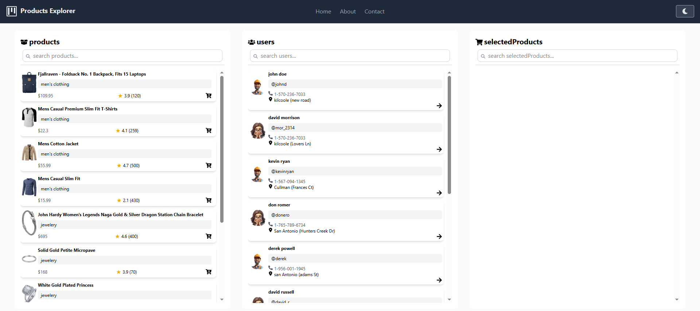

# Shahr ICT Task - Product Explorer


## Overview

This is a modern web application built with Next.js 15 that allows users to explore products, view user details, and manage a selection of products. The application features a responsive three-column layout with products, users, and selected products - all with search functionality.


## 🚀 Features

### Core Functionality
- **Three-column layout**:
  - Products column with infinite scroll pagination
  - Users column with quick user selection
  - Selected Products column for tracking chosen items
- **Search functionality** across all columns for easy filtering
- **Product selection**:
  - Interactive UI to add products to selection
  - Simple removal of products from selection
- **User details**:
  - Dedicated user profile page with detailed information
  - Map integration for location visualization
- **Responsive design** that adapts seamlessly across devices

### Technical Implementation
- Built with **Next.js 15** using App Router and TypeScript
- Styled with **TailwindCSS** for modern and responsive UI
- State management with **Redux Toolkit and RTK Query**
- **Atomic design** component architecture
- **Progressive Web App (PWA)** capabilities
- **Storybook** documentation for components
- Optimized performance with infinite scrolling

## 🛠️ Technologies Used

### Main Stack
- Next.js 15
- TypeScript
- TailwindCSS
- Redux Toolkit & RTK Query
- PWA Support

### Additional Libraries
- react-icons
- react-toastify
- next-themes (dark/light mode)
- Storybook

## 📂 Project Structure (Atomic Design)

The project follows the Atomic Design methodology with the following structure:

```
/
├── app/                  # Next.js App Router pages
│   ├── users/[id]/       # Dynamic user details page
│   ├── globals.css       # Global styles
│   └── page.tsx          # Home page
├── components/           # UI components following Atomic Design
│   ├── atoms/            # Basic components (buttons, inputs)
│   ├── molecules/        # Combinations of atoms (cards, form fields)
│   ├── organisms/        # Complex components (product lists, headers)
│   └── templates/        # Page layout templates
├── redux/                # Redux state management
│   ├── api/              # RTK Query API definitions
│   └── features/         # Redux slices
├── public/               # Static assets
├── types/                # TypeScript type definitions
└── utils/                # Utility functions and helpers
```

## 🔌 API Endpoints

- Users: `https://fakestoreapi.com/users`
- Products: `https://fakestoreapi.com/products`

## 🚀 Getting Started

### Prerequisites
- Node.js 18+ 
- npm or yarn

### Installation

1. Clone the repository:
   ```bash
   git clone (https://github.com/aliehs74/shahr-ict-task.git)
   cd shahr-ict-task
   ```

2. Install dependencies:
   ```bash
   npm install
   # or
   yarn install
   ```

3. Run the development server:
   ```bash
   npm run dev
   # or
   yarn dev
   ```

4. Open [http://localhost:1374](http://localhost:1374) in your browser.

### Running Storybook

```bash
npm run storybook
# or
yarn storybook
```

## 📋 Available Scripts

- `dev` - Start development server
- `build` - Create production build
- `start` - Start production server
- `lint` - Run ESLint
- `storybook` - Start Storybook for component development
- `build-storybook` - Build Storybook for deployment

## 📱 PWA Features

This application is configured as a Progressive Web App with:

- Offline functionality
- Add to home screen capability
- Fast loading and performance optimization
- Custom service worker implementation

## 📚 Storybook Documentation

Component documentation is available through Storybook, featuring:

- Interactive examples
- Prop documentation
- Various component states
- Responsive design previews

## 🔍 Key Implementation Details

### Infinite Scroll
The products column implements infinite scroll to efficiently load products as the user scrolls, improving performance and user experience.

### Theme Support
The application supports both light and dark themes with seamless switching using next-themes.

### Redux State Management
RTK Query handles API data fetching with caching, while Redux manages the local state for selected products.

## 📄 License

This project is licensed under the MIT License - see the LICENSE file for details.

## 👨‍💻 Author

Created as a technical assessment for Shahr ICT.
